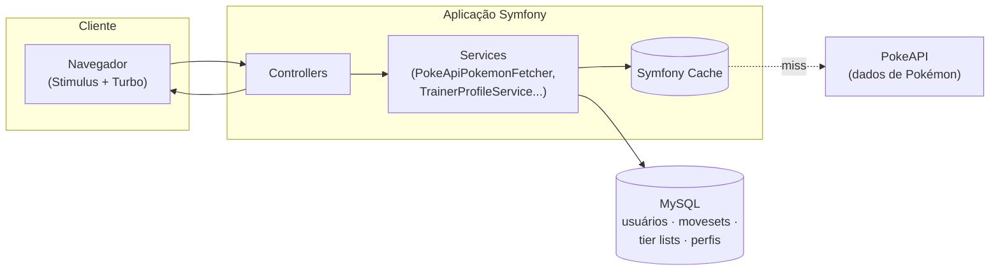

<div align="center">

# Mov Set — Portal & API de Movesets Pokémon

**Plataforma Web em PHP 8.4 e Symfony 7.2 com consumo otimizado de API externa, estratégia de caching sob demanda e arquitetura de persistência híbrida.**

[](https://github.com/thiago9852/Poke-Flaton/actions/workflows/ci.yml)


</div>

---

### 💡 Desafio de Engenharia & Solução

* **Desafio de Engenharia:** Consumir uma base massiva de dados estáticos externos ([PokeAPI](https://pokeapi.co/)) sem provocar requisições redundantes, estouro de rate limits, gargalos de rede ou duplicação desnecessária de dados em banco relacional.
* **Solução Técnica:** Arquitetura de persistência híbrida. A aplicação utiliza o `Symfony Cache` com TTL customizável para enriquecer e prover dados em memória sob demanda, reservando o banco de dados relacional (`MySQL 8` + `Doctrine ORM`) estritamente para os dados gerados pela comunidade (movesets, perfis de treinadores, tier lists e moderação).
* **Qualidade & CI/CD:** Este repositório mantém padrões rigorosos de qualidade de código validados automaticamente no GitHub Actions através de **PHPStan (Level 5)**, **Rector** (refatoração automática), **PHP-CS-Fixer** (estilo de código) e **PHPUnit** (testes automatizados).

---

## Índice

- [Screenshots](#screenshots)
- [Funcionalidades](#funcionalidades)
- [Arquitetura](#arquitetura)
- [Stack](#stack)
- [Como rodar](#como-rodar)
- [Qualidade de código](#qualidade-de-código)
- [Estrutura de pastas](#estrutura-de-pastas)

## Screenshots

<!--
  Sugestão de capturas (salvar em docs/screenshots/ com esses nomes):
  - home.png            → página inicial ("/")
  - pokedex.png         → listagem de Pokémon com filtros ("/pokemons")
  - pokemon-detail.png  → detalhe de um Pokémon com movesets ("/pokemon/{name}")
  - team-builder.png    → montagem de time ("/team")
  - tier-list.png       → tier list em edição ("/tier-list/{id}")
  - trainer-card.png    → card de treinador ("/trainer-card")
-->
<div align="center">
  
  
  
  
</div>

## Funcionalidades

**Movesets** — criação e votação de conjuntos de golpes por Pokémon (padrão, PVP, dungeons), com moderação de sugestões pelo admin.

**Team Builder** — montagem de times com busca de Pokémon integrada à PokeAPI.

**Tier List** — criação de tier lists customizadas por categoria (progressão PVE, PVP, dungeons/bosses, clã/time), públicas para a comunidade.

**Trainer Card** — perfil público do treinador com:
- Avatar e plano de fundo (template) customizáveis
- Mochila de TMs desbloqueadas
- Sistema de seguidores

**Login social** — autenticação via Google Sign-In, além de registro tradicional.

**Painel administrativo** — CRUD de templates de card, avatares, variações de Pokémon e regras de evolução; moderação de movesets e localizações sugeridas pela comunidade; importação em lote via JSON.

**Integração com Discord** — API própria (`/api/discord/*`) para bots consultarem dados de Pokémon e traduzir natures PT-BR ↔ EN.

## Arquitetura

O dado de Pokémon (stats, tipos, sprites, evoluções) **não vive no banco local** — é buscado da PokeAPI sob demanda e cacheado (`Symfony Cache`, TTL de dias). O banco local guarda apenas o que é específico da aplicação: usuários, movesets, tier lists, perfis de treinador.



Documentação técnica mais detalhada (módulos, modelo de dados, decisões e débito técnico conhecido) em **[docs/ARCHITECTURE.md](docs/ARCHITECTURE.md)**.

## Stack

| Camada | Tecnologia |
|---|---|
| Backend | PHP 8.4+, Symfony 7.2 (Doctrine ORM, Security, Forms, Serializer) |
| Frontend | Stimulus + Turbo (Symfony UX), AssetMapper (sem bundler externo) |
| Banco de dados | MySQL 8 |
| Dados externos | [PokeAPI](https://pokeapi.co/) via `HttpClient` + cache |
| Infra | Docker (Nginx + PHP-FPM em dev, Apache standalone em produção) |
| Qualidade | PHPStan, PHP-CS-Fixer, Rector, PHPUnit, GitHub Actions |

## Como rodar

### Com Docker (recomendado)

Pré-requisitos: Docker e Docker Compose.

```bash
cp .env .env.local
docker compose up -d --build
```

O `entrypoint` do container `php` instala as dependências do Composer e roda as migrations automaticamente no primeiro `up`.

| Serviço | URL |
|---|---|
| Aplicação (Nginx) | http://localhost:8080 |
| MySQL | localhost:3306 |
| Mailpit (emails em dev) | http://localhost:8025 |

### Sem Docker

```bash
composer install
php bin/console doctrine:migrations:migrate
symfony server:start
```

Ajuste `DATABASE_URL` no `.env.local` para seu MySQL local.

## Qualidade de código

```bash
composer phpstan     # análise estática (nível 5, com baseline para débito legado)
composer cs-fix       # aplica o padrão de código (PHP-CS-Fixer)
composer cs-check     # verifica sem aplicar
composer rector       # refactors automáticos (Rector)
composer test         # PHPUnit
```

Todas essas verificações rodam no CI (`.github/workflows/ci.yml`) a cada push/PR.

## Estrutura de pastas

```
src/
├── Controller/
│   ├── Admin/          # painel administrativo, dividido por domínio
│   └── ...              # rotas públicas (Pokémon, Team, TierList, TrainerCard...)
├── Entity/               # entidades Doctrine
├── Form/                 # formulários (admin e cadastro)
├── Repository/
├── Service/
│   └── PokeApi/          # camada de integração com a PokeAPI (fetch + cache + validação)
└── Enum/
templates/                # Twig, organizado por domínio
docs/                      # documentação técnica e screenshots
```
