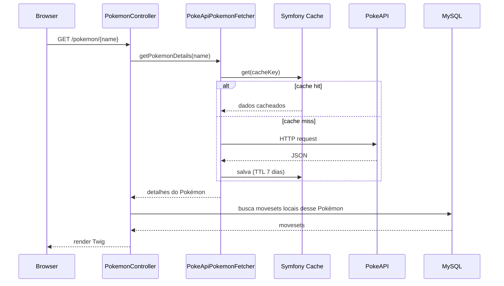
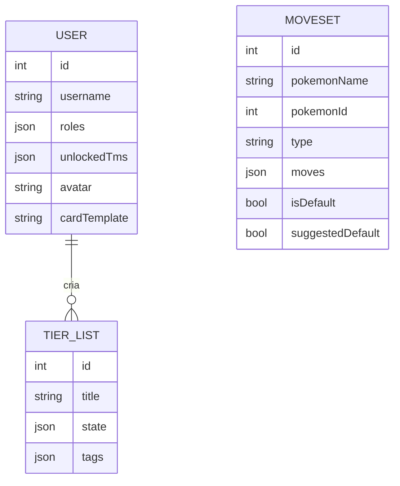

# Arquitetura

## Visão geral

O Mov Set segue a estrutura padrão de um app Symfony (MVC + camada de serviços), com uma decisão de arquitetura central que molda o resto do projeto: **o dado de Pokémon não é duplicado no banco local**.

Times, movesets, tier lists e o painel admin referenciam Pokémon por **nome/ID da PokeAPI** (campos simples como `pokemonName`, `pokemonId` nas entidades — não há uma entidade `Pokemon` local nem chave estrangeira para ela). Os dados ricos (stats, tipos, sprites, cadeia de evolução) são buscados da PokeAPI sob demanda e cacheados.

Isso significa duas fontes de verdade convivendo:

| Dado | Fonte | Onde vive |
|---|---|---|
| Stats, tipos, sprites, evoluções | PokeAPI | Cache (`Symfony Cache`, TTL de dias) |
| Movesets, times, tier lists, usuários, perfis de treinador | Comunidade / app | MySQL |
| Localizações, variações regionais, regras de evolução customizadas | Curadoria do admin | MySQL, cruzado com nome do Pokémon |

### Fluxo de uma requisição típica (ex: página de detalhe de Pokémon)

## Módulos de domínio

O `AdminController` original tinha 1115 linhas cobrindo domínios sem relação direta entre si. Foi dividido por responsabilidade — o padrão vale como referência para onde adicionar novas rotas admin:

| Controller | Responsabilidade |
|---|---|
| `Controller/AdminController` | Entrada do painel (`/admin`) e limpeza de cache |
| `Controller/Admin/AdminPokemonController` | Variações, regras de evolução, golpes base, importação em lote, moderação de movesets |
| `Controller/Admin/AdminGamificationController` | Templates de card e avatares disponíveis (sincronização a partir do GitHub) |

Nas rotas públicas, cada domínio tem seu próprio controller: `PokemonController` (pokédex, detalhe, busca de golpes), `TeamController` (montador de times), `TierListController`, `TrainerCardController` (perfil, seguidores), `MovesetController`, `DiscordApiController` (API para bots), `SecurityController` (login/registro/OAuth Google).

`TrainerProfileService` centraliza as estatísticas e a customização do perfil do treinador (avatar, template de card).

## Camada de integração com a PokeAPI (`Service/PokeApi/`)

- **`PokeApiPokemonFetcher`** — busca e normaliza dados de Pokémon (lista paginada, por tipo, detalhes, espécie), com cache por chave versionada (`pokemon_details_v5_*`) para permitir invalidação controlada quando o formato interno muda.
- **`PokeApiDetailsFetcher`** — detalhes complementares (efetividade de tipos, etc.).
- **`PokeApiValidator`** — filtra quais IDs/formas são exibidos (evita variantes que a PokeAPI expõe mas o app não quer mostrar).
- **`PokeApiService`** — fachada usada pelos controllers, delega para os fetchers acima.

Nomes de Pokémon com formas múltiplas (ex: `burmy`, `wormadam`, `toxtricity`, `basculin`) passam por `resolveNameAlias()`/`getSpeciesName()` para mapear entre o "nome canônico" usado internamente e o nome que a PokeAPI espera — essa normalização é replicada (não compartilhada) em `AdminPokemonController::getSpeciesName()` para as importações do admin; são listas de sufixo similares mas não idênticas, então **não assuma que são intercambiáveis** ao editar uma sem checar a outra.

## Modelo de dados (entidades com relação direta)

A maioria das entidades é independente entre si (ligadas por nome de Pokémon como string, não FK). As poucas relações reais via Doctrine:

`Moveset`, `PokemonLocation`, `PokemonVariation`, `EvolutionRule`, `CardTemplate`, `Avatar` não têm FK entre si — são consultadas e cruzadas em memória pelos services usando o nome do Pokémon como chave.

## Estratégia de cache

Chaves de cache versionadas (`_v2`, `_v3`, `_v5`...) permitem invalidar dados antigos sem precisar limpar o cache inteiro — ao mudar o formato de um payload cacheado, incrementa-se a versão na chave em vez de alterar a lógica de invalidação. TTLs são longos (7 dias) porque dados de Pokémon (stats, tipos) praticamente não mudam.

## Decisões técnicas e trade-offs

- **AssetMapper em vez de Webpack Encore/Vite** — projeto pequeno, sem necessidade de bundling complexo; menos configuração, custo é menor tree-shaking.
- **Sem entidade `Pokemon` local** — evita duplicar ~1000+ registros da PokeAPI e mantê-los sincronizados; trade-off é que toda consulta "por tipo" ou "por geração" depende de cache quente ou de uma chamada à API externa.
- **PHPStan com baseline em vez de nível 5 limpo** — o projeto tem histórico de mudanças rápidas; o baseline (`phpstan-baseline.neon`) captura o débito técnico existente sem bloquear o CI, deixando claro o que é dívida conhecida vs. regressão nova.
- **`AdminController` dividido por domínio, mas `PokeApiPokemonFetcher` não** — a divisão de controllers foi segura por preservar nomes/paths de rota; decompor esse service exigiria testes de regressão para sua lógica, que ainda não existem.
- **Medalhas, títulos e ranking entre treinadores foram removidos** — eram um sistema de progressão que, na prática, já estava sem nenhuma trava de desbloqueio real ("Portfolio mode: tudo desbloqueado" hardcoded no código antigo). A remoção incluiu uma migration dropando a tabela `title` e as colunas `req_medal`/`req_tier`/`req_gold_count`/`req_rank_type`/`req_rank_pos` de `avatar` e `card_template`, já que nada mais as lia. Avatar e template de card continuam customizáveis — só a camada de "regras de desbloqueio" saiu.
